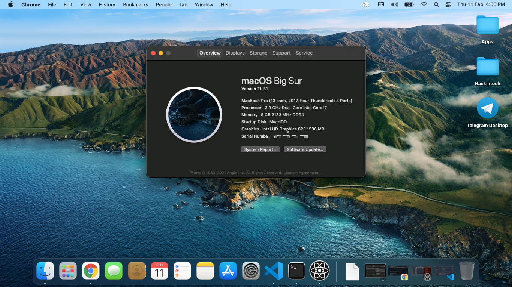

# Asus F556U (X556UQK) - Big Sur 11.4 Hackintosh Open Core 0.71

Release Version
- Modern Opencore Picker (Disabled), Require to enable for OS installation (config key 'ShowPicker' set to true)
- Bootchime

To Debug, please enable verbose mode and follow all the Keys below

- AppleDebug (true)
- ApplePanic (true)
- Target (67)
- boot-args (-v keepsyms=1 alcid=13 -wegnoegpu)

### Note
***Please use SSDTTime to patch your own SSDT, do not use mine as not all the configuration work the same on your device.***

***You can only dump SSDT on Windows or Linux***

Please downgrade your bios if you're at version 3.1.5. This will cause graphic issue.

***Please generate your own SMBIOS SN, UUID using MacBookPro14,1 and change your ROM based on your Ethernet Mac Address.***

### Catalina Note

In case if you want to use Catalina 10.5 instead of Big Sur, change AirportItlwm.kext kest to Catalina version and enable xhciportlimit on config.plist

### Technical Specifications
---

| Name              | Specifications                                                                                                                           |
| ----------------- | ---------------------------------------------------------------------------------------------------------------------------------------- |
| Processor         | Intel Core i7 - 7600u                                                                                                                    |
| Memory            | 1x 8 GB DDR4 2133 Mhz                                                                                                                    |
| Storage           | SSD 840 EVO 250GB                                                                                                                        |
| Video             | Integrated Intel HD 620 + NVIDIA 940MX                                                                                                   |
| Wi-Fi + Bluetooth | ~~Qualcomm Atheros 9565~~ Replaced by Intel AX200                                                                                         |
| Ethernet          | Realtek RTL8111                                                                                                                          |
| Audio             | Realtek ALC255                                                                                                                           |
| Touchpad          | ELAN 1000 I2C Interface                                                                                                                  |
| Screen Size       | 15,6 Inch                                                                                                                                |
| Screen Resolution | 1920 x 1080                                                                                                                              |
| Others            | 1x Card Reader, 1x WebCam, 1x VGA Port, 1x HDMI, 1x Combo Audio Jack, 1x USB 2.0, 1x USB 3.0 Type A, 1x USB 3.0 Type C, 1x Optical Drive |

# What works
✅ Intel HD 620

✅ All USB Type A ports

✅ USB type C port

✅ Keyboard

✅ Touchpad

✅ Internal screen backlight change

✅ Wi-Fi

✅ UVC HD Webcam

✅ Speaker

✅ Laptop lid

✅ Native power managment

✅ Battery status

✅ ️Sleep

✅ Bluetooth 

✅ IServices  (IMessage, FaceTime, ICloud)  (Make sure you set your own SMbios and generate your own Serial Number using GenSMBIOS)

✅ Onboard Ethernet

⚠️ FN Keys (Brightness Control, Volume Control, Sleep works except for Disable TouchPad, Disable Screen etc)

⚠️ Realtek SD card reader

⚠️ VGA/HDMI (Audio + Video) Not tested (Anyone who has VGA or HDMI tested, please update me)

❌ Hardware DRM not supported on Big Sur, but works on Catalina 10.5 based on WhateverGreen chart

❌ NVIDIA GeForce 940MX (Optimus - impossible to get working at the moment)
